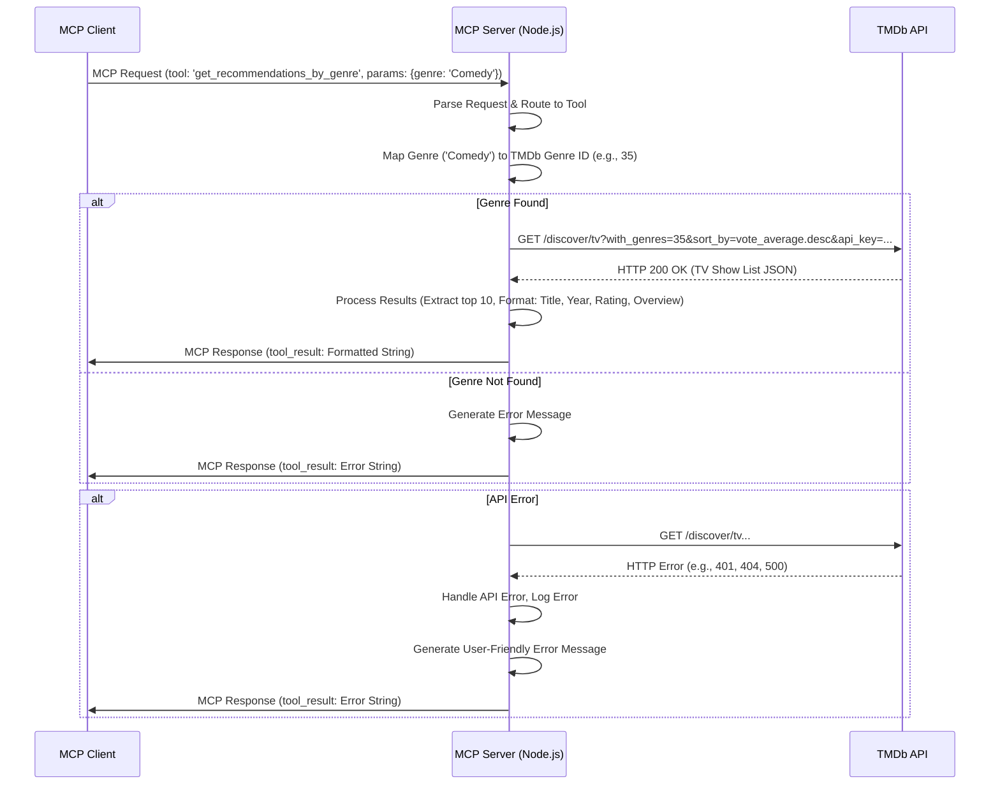
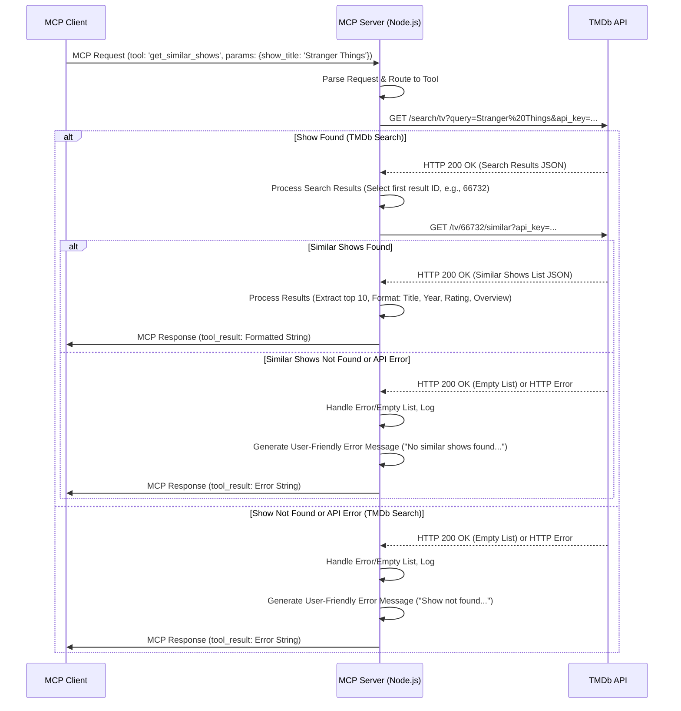
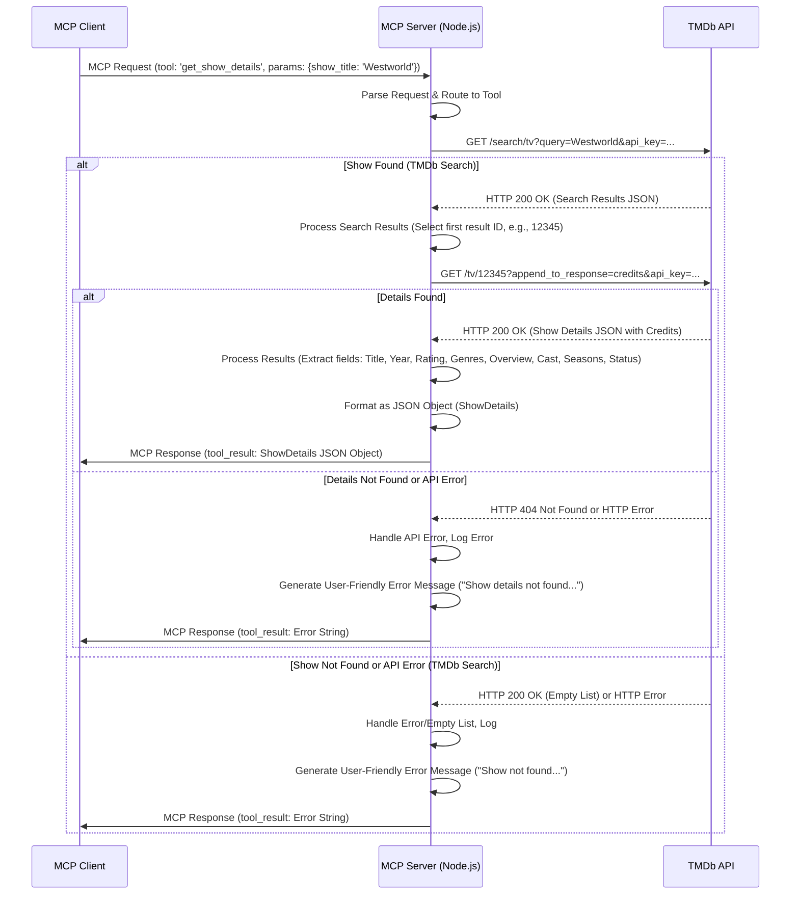

# Architecture for 美剧推荐 MCP 服务器

Status: Draft

## Technical Summary

本项目旨在构建一个 Model Context Protocol (MCP) 服务器，专门用于提供美剧推荐服务。该服务器将作为一个独立的 Node.js 应用程序运行，通过标准输入/输出 (stdio) 与支持 MCP 的客户端（如 LLM 客户端）进行通信。服务器核心功能是暴露一组工具 (Tools)，这些工具通过调用外部的 The Movie Database (TMDb) API 来获取数据，并将处理后的结果返回给客户端。MVP 阶段将实现三个核心工具：按类型推荐 (`get_recommendations_by_genre`)、查找相似剧集 (`get_similar_shows`) 和获取剧集详情 (`get_show_details`)。架构重点在于模块化、可维护性和清晰的 API 调用流程。

## Technology Table

| Technology          | Description                                              | Notes/Decision (from PRD)                      |
| ------------------- | -------------------------------------------------------- | ---------------------------------------------- |
| Language            | TypeScript                                               | 用户偏好，提供类型安全                       |
| Runtime             | Node.js                                                  | 执行 TypeScript 代码的基础环境                 |
| MCP SDK             | MCP TypeScript SDK (`@mcp/server` 或类似)                  | 实现 MCP 服务器协议的核心依赖                |
| HTTP Client         | `axios`                                                  | 用于向 TMDb API 发送 HTTP 请求，功能强大易用     |
| External API        | TMDb (The Movie Database)                                | 提供丰富的影视数据和推荐功能                 |
| Package Manager     | `npm` 或 `yarn`                                          | Node.js/TypeScript 项目标准包管理工具          |
| API Key Management  | Environment Variables (`dotenv` 包)                      | 安全地管理 TMDb API Key，避免硬编码            |
| Development Tools   | `ts-node-dev` / `nodemon`                                | 用于开发过程中的热重载，提高效率             |
| Logging             | `pino` (推荐) 或 `console.log` (基础)                   | 记录关键事件和错误，便于调试和监控         |
| Deployment (MVP)    | 本地运行 (Local Execution)                               | MVP 阶段的部署方式                             |

## Architectural Diagrams

### 1. High-Level Component Diagram

```mermaid
graph TD
    subgraph MCP Client (e.g., LLM)
        Client[Client Application]
    end

    subgraph MCP Server (Node.js/TypeScript)
        MCPCore[MCP Core (stdio)] -- Processes Requests --> ToolRouter[Tool Router]
        ToolRouter -- Routes to --> ToolImpl(Tool Implementations)
        ToolImpl -- Uses --> TMDbClient[TMDb Service Client]
        ToolImpl -- Uses --> Utils[Utilities (e.g., Genre Map)]
        TMDbClient -- HTTP Requests --> ExternalAPI[TMDb API]
        MCPCore -- Sends Responses --> Client
        ToolImpl -- Logs --> Logging[Logging Framework]
        TMDbClient -- Logs --> Logging
    end

    Client -- MCP Requests (stdio) --> MCPCore
    ExternalAPI -- HTTP Responses --> TMDbClient

    style MCP Server fill:#f9f,stroke:#333,stroke-width:2px
    style MCP Client fill:#ccf,stroke:#333,stroke-width:2px
```

### 2. Sequence Diagram: `get_recommendations_by_genre` Flow



### 3. Sequence Diagram: `get_similar_shows` Flow



### 4. Sequence Diagram: `get_show_details` Flow



## Data Models, API Specs, Schemas, etc...

### Key TypeScript Interfaces

```typescript
// .ai/story-1.2.md & .ai/story-1.3.md (Output for LLM is formatted string, but internally might use this)
interface ShowRecommendation {
  title: string;
  year: number; // Extracted from first_air_date
  rating: number; // vote_average
  overview: string;
}

// .ai/story-1.4.md (Final Output Structure)
// Defined in: src/types/index.ts (or similar)
interface ShowDetails {
  title: string;       // name
  year: number;        // Extracted from first_air_date
  rating: number;      // vote_average
  genres: string[];    // Extracted from genres array
  overview: string;    // overview
  cast: string[];      // Extracted from credits.cast (e.g., top 5)
  numberOfSeasons: number; // number_of_seasons
  status: string;      // status (potentially mapped to user-friendly text)
}

// Tool Input Parameter Interfaces (Conceptual)
interface GetRecommendationsByGenreParams {
  genre: string;
}

interface GetSimilarShowsParams {
  show_title: string;
}

interface GetShowDetailsParams {
  show_title: string;
}

// Generic Tool Result Type (Conceptual - what the server returns)
type ToolResult = string | ShowDetails;
```

### Environment Variables

```plaintext
# .env file (Add to .gitignore)
TMDB_API_KEY=YOUR_SECRET_TMDB_API_KEY
# Optional: LOG_LEVEL=info
```

## Project Structure

(Based on PRD and Story Structures)

```
tv-recommender-mcp-server/
├── .ai/                  # Architecture, PRD, Stories
│   ├── architecture.md
│   ├── prd.md
│   ├── story-1.1.md
│   ├── story-1.2.md
│   ├── story-1.3.md
│   └── story-1.4.md
├── .cursor/              # Cursor specific files (rules, templates)
│   ├── rules/
│   └── templates/
├── src/                  # Source code
│   ├── server.ts         # Main MCP server initialization, tool registration
│   ├── tools/            # Tool implementation logic
│   │   ├── recommendations.ts # Logic for get_recommendations_by_genre, get_similar_shows
│   │   └── details.ts      # Logic for get_show_details
│   ├── services/         # External API interaction logic
│   │   └── tmdbClient.ts   # TMDb API client wrapper (using axios)
│   ├── types/            # Shared TypeScript types/interfaces
│   │   └── index.ts        # e.g., ShowDetails, ShowRecommendation interfaces
│   └── utils/            # Utility functions
│       ├── genreMap.ts     # Mapping for genre names to TMDb IDs
│       ├── errorHandler.ts # Global error handling utilities (optional)
│       └── config.ts       # Configuration loading (e.g., API Key from env)
├── tests/                # Unit/Integration tests (Post-MVP or as needed)
├── .env.example          # Example environment variables file
├── .env                  # Actual environment variables (added to .gitignore)
├── .gitignore
├── package.json
├── tsconfig.json
└── README.md             # Project overview, setup, usage instructions
```

## Infrastructure

*   **Compute:** Node.js runtime environment. For MVP, this will be the local development machine.
*   **External Dependencies:** TMDb API (requires internet connectivity and a valid API key).

## Deployment Plan

*   **MVP:** Local execution. The server will be started manually on the developer's machine using `npm start` or `yarn start`. It will communicate via stdio with an MCP client running on the same machine.
*   **Future Considerations:** Containerization (Docker) for easier deployment to cloud environments (e.g., AWS Fargate, Google Cloud Run) or dedicated servers. CI/CD pipeline for automated builds, tests, and deployments.

## Security Considerations

*   **API Key Management:** The TMDb API key is sensitive and **must not** be hardcoded in the source code or committed to version control. It will be loaded exclusively from environment variables using the `dotenv` package. The `.env` file must be included in `.gitignore`.
*   **Input Sanitization:** While MCP communication is generally trusted between client/server, basic validation of input parameters (e.g., checking if `genre` or `show_title` are non-empty strings) is recommended within the tool implementation.
*   **Rate Limiting:** Be mindful of TMDb API rate limits. Implement basic retry logic (e.g., exponential backoff with `axios-retry`) or caching if necessary in future iterations, although likely not required for MVP local usage.
*   **Dependencies:** Keep dependencies updated (`npm audit`, `yarn audit`) to patch known vulnerabilities.

## Scalability and Performance

*   **MVP Focus:** MVP prioritizes functional correctness over high scalability. Performance target is P95 < 2 seconds per tool execution, primarily dependent on TMDb API response times.
*   **Bottlenecks:** The main potential bottleneck is the external TMDb API call latency.
*   **Future Scaling:**
    *   **Statelessness:** The server should be designed stateless to allow horizontal scaling if deployed in multiple instances behind a load balancer (not applicable for stdio-based MCP, but relevant if transitioning to HTTP).
    *   **Caching:** Implement caching (e.g., in-memory cache like `node-cache` or external Redis) for frequently requested data like genre mappings or popular show details to reduce API calls.
    *   **Asynchronous Operations:** Node.js is inherently asynchronous, suitable for I/O-bound tasks like API calls. Ensure non-blocking code practices.

## Maintainability

*   **Modularity:** Separate concerns into distinct modules (server core, tools, services, utils, types) as outlined in the Project Structure.
*   **Typing:** Leverage TypeScript's static typing for better code clarity, refactoring safety, and catching errors early. Define clear interfaces for data structures (`ShowDetails`, `ShowRecommendation`, API responses).
*   **Code Style:** Use a consistent code style enforced by linters (e.g., ESLint) and formatters (e.g., Prettier).
*   **Configuration:** Centralize configuration loading (API keys, potentially log levels) in a dedicated utility or module.
*   **Logging:** Implement meaningful logging to aid debugging and understanding application flow.
*   **Testing:** While extensive tests might be post-MVP, designing code with testability in mind (e.g., dependency injection for the TMDb client) is beneficial.

## Change Log

| Version | Date       | Author | Change Description                       |
|---------|------------|--------|------------------------------------------|
| 0.1     | {Date}     | AI     | Initial Draft based on PRD and Stories | 