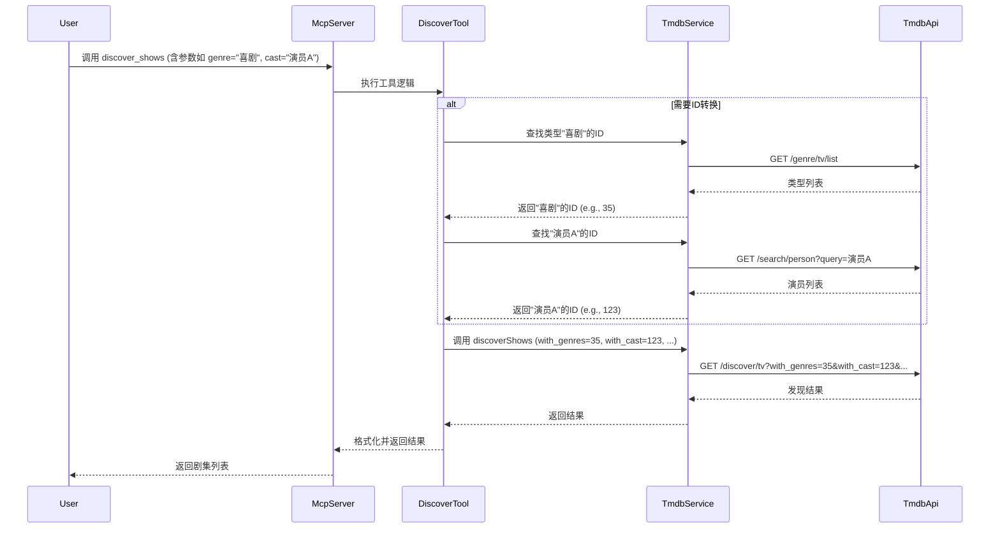

# Epic-1 - Story-2

实现高级剧集发现功能 (Implement Advanced Show Discovery)

**As a** 用户 (User)
**I want** 使用多种条件组合（如演员、评分、年份、关键词、播放平台等）来搜索和发现剧集 (to search and discover TV shows using a combination of criteria like actors, rating, year, keywords, networks, etc.)
**so that** 我可以更精确地找到符合我特定口味或要求的剧集 (I can find shows that match my specific tastes or requirements more precisely)

## Status

Draft

## Context

- 当前只有按类型的基本推荐。
- 此功能利用TMDB的 `/discover/tv` API端点提供更强大的搜索能力，允许用户组合多个筛选条件。
- 这是对现有推荐功能的重要补充和增强。

## Estimation

Story Points: 3

## Tasks

1.  - [ ] 定义新的MCP工具 `discover_shows`
    1.  - [ ] 设计工具输入参数: 包含多个可选筛选条件的对象，如 `with_genres`, `with_cast`, `vote_average_gte`, `first_air_date_year`, `with_networks`, `with_keywords`, `page` 等。
    2.  - [ ] 设计工具输出格式: 包含剧集列表 (带基本信息如标题、评分、简介、海报路径)、当前页码、总页数、总结果数。
2.  - [ ] 实现TMDB API调用逻辑
    1.  - [ ] 添加函数：调用 `/discover/tv` API，动态构建查询参数。
    2.  - [ ] 处理用户输入的友好名称到API所需ID的转换 (例如，类型名称 -> 类型ID，演员名称 -> 演员ID)。这可能需要调用 `/genre/tv/list`, `/search/person`, `/search/keyword` 等API。
    3.  - [ ] 处理分页逻辑。
    4.  - [ ] 处理API响应和错误。
3.  - [ ] 编写单元测试
    1.  - [ ] 测试不同筛选参数组合的API调用。
    2.  - [ ] 测试ID转换逻辑 (类型、演员等)。
    3.  - [ ] 测试分页。
    4.  - [ ] 测试错误处理。

## Constraints

- 需要有效处理大量可选参数的组合及参数验证。
- 某些筛选条件需要先通过其他API获取ID，增加了实现的复杂度。
- 需要考虑TMDB API的速率限制。

## Data Models / Schema

- **Input (Example - 参数需根据TMDB文档细化):**
  ```json
  {
    "with_genres": ["喜剧", "科幻"], // 或者 Genre IDs [18, 10765]
    "with_cast": ["布莱恩·科兰斯顿"], // 或者 Person ID [17419]
    "first_air_date_year": 2022,
    "vote_average_gte": 8.0,
    "with_networks": [213], // 例如 Netflix ID
    "sort_by": "popularity.desc", // 例如按流行度降序
    "page": 1
  }
  ```
- **Output (Example):**
  ```json
  {
    "page": 1,
    "results": [
      {
        "id": 94997,
        "name": "House of the Dragon",
        "overview": "The Targaryen dynasty is at the absolute apex of its power...",
        "poster_path": "/z2yahl2uefxDCl0nogcRBstwruJ.jpg",
        "vote_average": 8.5
      }
      // ... more show summaries
    ],
    "total_pages": 50,
    "total_results": 1000
  }
  ```
  *注：`poster_path` 需要结合TMDB配置API中的 `images.secure_base_url` 来构建完整URL。*

## Structure

- 新增工具实现文件: `src/tools/discoverShowsTool.ts`
- 更新服务层: `src/services/tmdbService.ts` (添加 `/discover/tv` 及可能需要的搜索/列表API调用方法)
- 更新服务器入口: `src/server.ts` (注册新工具)
- 可能需要新增 `src/utils/tmdbIdMapping.ts` 来处理名称到ID的转换。

## Diagrams



## Dev Notes

- 仔细查阅 `/discover/tv` API文档，了解所有可用筛选参数和 `sort_by` 选项。
- ID转换逻辑是关键，需要健壮地处理找不到ID的情况。
- 考虑为常用列表（如类型）实现缓存，减少API调用。

## Chat Command Log

- (待填充) 